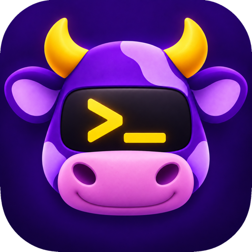

<p align="center">
  
</p>

<h1 align="center">Moo Terminal</h1>

<p align="center">
  A native, open-source macOS terminal with Ghostty-class speed — faster on throughput and
  keystroke latency in <a href="docs/PERFORMANCE.md">measured runs</a> — and the
  workspace features that make cmux good for running agents.
</p>

<p align="center">
  <a href="LICENSE"></a>
  <a href="#quick-install"></a>
</p>

## Table of Contents

- [Overview](#overview)
- [Screenshots](#screenshots)
- [Quick Install](#quick-install)
- [Speed](#speed)
- [Features](#features)
- [Usage](#usage)
- [Keyboard Shortcuts](#keyboard-shortcuts)
- [How Moo Came Out of Tecolot](#how-moo-came-out-of-tecolot)
- [Building from Source](#building-from-source)
- [Documentation](#documentation)
- [Acknowledgements](#acknowledgements)
- [Third-Party Components](#third-party-components)
- [License](#license)

## Overview

Moo is my personal terminal setup: the one I use all day, tuned to how I work.
I share it in case it is useful to someone else, but its defaults, shortcuts
and features follow my workflow, and there is no promise of support.

It aims for two things at once:

- **The speed of Ghostty.** Moo runs on [SwiftTerm](https://github.com/migueldeicaza/SwiftTerm)
  with engine work of its own, and in side-by-side runs it pushes output
  through a pty faster than Ghostty and gets a keystroke on screen sooner.
- **The workflow of cmux.** Terminals are grouped into workspaces in a sidebar
  that says which ones are busy, finished or waiting for you. Tabs hold Markdown
  previews and web pages beside shells, panes split and zoom, and ⌘K reaches
  every command and anything worth grabbing on screen.

## Screenshots

<p align="center"><b>Terminal</b></p>
<p align="center">
  <a href="https://moo.vpetkov.net/screenshots/moo-terminal.png"></a>
</p>
<p align="center"><i>Fast, native, and out of the way: one window, tabs across the top.</i></p>

<table>
  <tr>
    <td width="50%" align="center"><b>Markdown preview</b></td>
    <td width="50%" align="center"><b>Browser tabs</b></td>
  </tr>
  <tr>
    <td width="50%"><a href="https://moo.vpetkov.net/screenshots/moo-markdown.png?v=2"></a></td>
    <td width="50%"><a href="https://moo.vpetkov.net/screenshots/moo-browser.png"></a></td>
  </tr>
  <tr>
    <td align="center"><i>Markdown files open rendered, in a tab beside the shell</i></td>
    <td align="center"><i>Web pages open as browser tabs, with ad blocking</i></td>
  </tr>
  <tr>
    <td width="50%" align="center"><b>Workspaces</b></td>
    <td width="50%" align="center"><b>Themes</b></td>
  </tr>
  <tr>
    <td width="50%"><a href="https://moo.vpetkov.net/screenshots/moo-projects-terminal.png"></a></td>
    <td width="50%"><a href="https://moo.vpetkov.net/screenshots/moo-settings-themes.png"></a></td>
  </tr>
  <tr>
    <td align="center"><i>Workspaces in the sidebar, each with its own tabs and status</i></td>
    <td align="center"><i>Over 140 bundled themes, browsable as a list or in 2D and 3D</i></td>
  </tr>
</table>

More at [moo.vpetkov.net](https://moo.vpetkov.net).

## Quick Install

Download **[Moo.dmg](https://github.com/ventz/moo-mac-terminal/releases/latest)**,
open it, and drag Moo to Applications. Or from a terminal:

```bash
curl -fLO https://moo.vpetkov.net/Moo.dmg
hdiutil attach Moo.dmg && cp -R /Volumes/Moo/Moo.app /Applications/
hdiutil detach /Volumes/Moo && open /Applications/Moo.app
```

Requires macOS 15.5+ on Apple silicon or Intel. The app is signed with a
Developer ID and notarized by Apple, and it updates itself: new releases are
checked for automatically and can be installed from **Moo → Check for
Updates…**. To build it yourself, see [Building from Source](#building-from-source).

## Speed

Measured on 2026-09-13, M3 MacBook Pro at 120 Hz, against Ghostty 1.3.1:

| | Moo | Ghostty | |
|---|---|---|---|
| 100 MB plain text through a pty | 0.33 s | 1.12 s | 3.4× faster |
| 60 MB 256-color text | 0.31 s | 0.79 s | 2.5× faster |
| 5,000 full-screen redraws | 0.15 s | 0.74 s | 5.0× faster |
| Keystroke to screen, p50 / p99 | 21 / 27 ms | 28.6 / 39 ms | 7.5 / 12 ms sooner |
| Idle CPU, one window, per minute | 0.01–0.02 s | < 0.01 s | Ghostty lower |

Plain text is already at the limit of a macOS pty, so the gains that matter are
colored output, redraws and latency. How each number was taken, what was tried
and rejected, and the traps in measuring terminals are in
[docs/PERFORMANCE.md](docs/PERFORMANCE.md).

## Features

- **Workspaces.** A sidebar groups terminals into projects, each with its own
  tabs. Switching swaps the whole working set; the shells left behind keep
  running. Each row shows whether it is idle, running, has new output, or is
  waiting for you. Workspaces, tabs and splits reopen after a relaunch.
- **Waiting-for-you notifications.** When an agent such as Claude Code asks
  for input, its tab, its workspace, the menu bar bell and the Dock say so.
  Click an entry to land in that window, workspace, tab and split.
- **Command status.** A tab whose last command failed gets a red mark, and a
  long command finishing in a pane you are not looking at notifies you.
- **Command palette.** ⌘K lists every menu command plus the links, paths,
  commit hashes and IP addresses on screen. Return runs or copies; ⌘Return
  opens.
- **Tabs beyond shells.** Markdown files open as rendered, GitHub-style tabs;
  web pages open as browser tabs with ad blocking, next to the terminal that
  printed them.
- **Splits and zoom.** Split with ⌘D and ⇧⌘D; ⇧⌘↩ zooms one pane to fill the
  tab and back, keeping the dividers where you left them.
- **Safe by default.** Secure Keyboard Entry turns on by itself at password
  prompts. Links in terminal output open only the web and mail without asking,
  and files that would run are revealed in Finder instead.

## Usage

Create a workspace from the sidebar (⌘B shows it), or press ⌘T for a new tab
in the current one. The status on each row is live: **Idle** at a prompt,
**Running** with a command in flight, **Activity** when a background workspace
printed something, **Waiting** when a program asked for you.

**Notifications** come from the escape sequences iTerm2, Ghostty and kitty use
(OSC 9, 777 and 99) and collect in the menu bar bell and Window → Notifications.
Settings → Notifications picks banners, Dock badge, sounds and the long-command
threshold. Claude Code only notifies terminals it recognizes: inside Claude
Code, run `/config` and set **Notifications** to `ghostty`.

**Command status** needs Moo's shell integration for zsh, bash, fish or elvish,
which reports when each command starts and how it exited.

**Links and files**: hold ⌘ to underline what is clickable in terminal output,
including bare file names from `ls` such as `README.md`. Command-click opens it:
Markdown files and web links as Moo tabs, folders in the Finder, and other
files in their default app. Anything that would run (apps, scripts) is only
revealed in the Finder, never launched.

**Markdown and web tabs**: command-click a `.md` path or a link, or use ⇧⌘M and
the File menu. Previews reload as the file changes and are light by default;
Settings → General → Markdown previews can make them follow the terminal theme.

**Restore** is on by default (Settings → Projects). Shells start fresh in each
pane's last directory; scrollback, commands and environment are never saved.

## Keyboard Shortcuts

| Keys | Action |
|---|---|
| ⌘K | Command palette |
| ⌥⌘K | Clear scrollback |
| ⌘T / ⌘W | New tab / close pane or tab |
| ⌘D / ⇧⌘D | Split side by side / stacked |
| ⇧⌘↩ | Zoom pane |
| ⌥⌘ arrows | Move between splits |
| ⌘↑ / ⌘↓ | Jump to the previous / next prompt |
| ⌘B | Show or hide the sidebar |
| ⇧⌘U | Newest unread notification |
| ⇧⌘M | Open a Markdown preview |

## How Moo Came Out of Tecolot

Moo started on 2026-09-10 as a personal customization of Miguel de Icaza's
[Tecolot](https://github.com/migueldeicaza/Tecolot), forked at `v0.0.22`. What
began as three additions (projects, Markdown tabs, browser tabs) grew into a
hard fork: it now goes its own way, takes upstream fixes by hand, and sends
fixes that belong upstream back as pull requests to Tecolot and SwiftTerm.

What Moo adds on top of Tecolot:

- **Workspaces**: projects in a sidebar with live status, their own tabs, and
  selection kept per window, restored with their tabs and splits on relaunch.
- **Markdown preview tabs**, hardened against hostile files.
- **Browser tabs** with ad blocking, sandboxed against hostile pages.
- **Waiting-for-you notifications** from OSC 9, 777 and 99, with a menu bar
  bell, Dock badge, sounds and tab marks.
- **Failed-command marks and long-command notifications** from OSC 133.
- **A ⌘K command palette** over every menu command and what is on screen.
- **Pane zoom**, horizontal splits on ⇧⌘D, and new tabs that open where the
  last one was.
- **Engine speed**: SwiftTerm built from a branch carrying an attribute intern
  cache (+26.5% on colored output) and idle process polling cut back.
- **Security**: automatic Secure Keyboard Entry at password prompts; links from
  output limited to web and mail unless confirmed; files that would run revealed,
  never launched; remote shells' directories never treated as local; clipboard
  requests naming the pane and defaulting to Deny.
- **Everyday details**: drop files onto the terminal to insert their paths,
  command-click a bare filename, Terminal.app-style window titles, tabs named
  after the running program, and profile files that carry their theme and app
  settings.

## Building from Source

```bash
git clone https://github.com/ventz/moo-mac-terminal
cd moo-mac-terminal
xcodebuild -downloadComponent MetalToolchain   # one time, ~688 MB
open Moo.xcodeproj                             # ⌘R to build and run
```

Requires Xcode 26 or later. The Metal Toolchain is not optional: the renderer
compiles a Metal shader, and a stock Xcode fails about 90% of the way through
the build without it.

Debug build and run from the command line:

```bash
xcodebuild build -project Moo.xcodeproj -scheme Moo \
  -configuration Debug -destination "platform=macOS" \
  -skipPackagePluginValidation \
  -derivedDataPath build/DerivedData
open build/DerivedData/Build/Products/Debug/Moo.app
```

`-skipPackagePluginValidation` is required: SwiftTerm ships a build-tool
plugin. Release builds are universal (`x86_64 arm64`); local Debug builds are
arm64-only. Release packaging, signing and notarization are in
[docs/DEVELOPING.md](docs/DEVELOPING.md).

## Documentation

**[docs/DEVELOPING.md](docs/DEVELOPING.md)**: the developer guide, covering
build prerequisites, code signing and why the certificate type matters,
notarization, cutting a release, tracking upstream, and troubleshooting.

**[docs/PERFORMANCE.md](docs/PERFORMANCE.md)**: how Moo compares with Ghostty
on throughput, keystroke latency and idle CPU, where the latency goes, the
engine changes that paid off and the ones that did not, and how each number
was measured.

## Acknowledgements

**Moo Terminal exists because of [Miguel de Icaza](https://github.com/migueldeicaza).**

Tecolot is the application underneath: the windows and panes, the profiles and
themes, the automation, the persistence. SwiftTerm, also his, is the emulation
itself: parsing, buffers, rendering, the pty. Nearly every line of this program
is his work.

Both Tecolot and SwiftTerm are MIT licensed, © 2026 Miguel de Icaza. Moo is not
affiliated with or endorsed by him, nor by the Ghostty or cmux projects it is
compared with here.

**Please report bugs to the right place.** If a problem reproduces in Tecolot
itself, it belongs [upstream](https://github.com/migueldeicaza/Tecolot/issues),
where everyone benefits from the fix. Only fork-specific behavior belongs here.

SwiftTerm in turn builds on the work of the
[xterm.js](https://github.com/xtermjs/xterm.js) authors, SourceLair Private
Company, and Christopher Jeffrey.

## Third-Party Components

| Component | Author | License |
|---|---|---|
| [SwiftTerm](https://github.com/migueldeicaza/SwiftTerm) | Miguel de Icaza | MIT |
| [Sparkle](https://sparkle-project.org) | Sparkle contributors | MIT |
| [swift-argument-parser](https://github.com/apple/swift-argument-parser) | Apple | Apache 2.0 |
| [swift-png](https://github.com/tayloraswift/swift-png) | Taylor Swift (tayloraswift) | MPL 2.0 |
| Symbols Nerd Font (Nerd Fonts 3.4.0) | Nerd Fonts contributors | MIT |

Sparkle auto-update is deliberately disabled: this fork publishes no appcast,
and inheriting upstream's feed would install the upstream app over Moo.

## License

[MIT](LICENSE) © Miguel de Icaza (original work) and © Ventz Petkov (fork changes)
